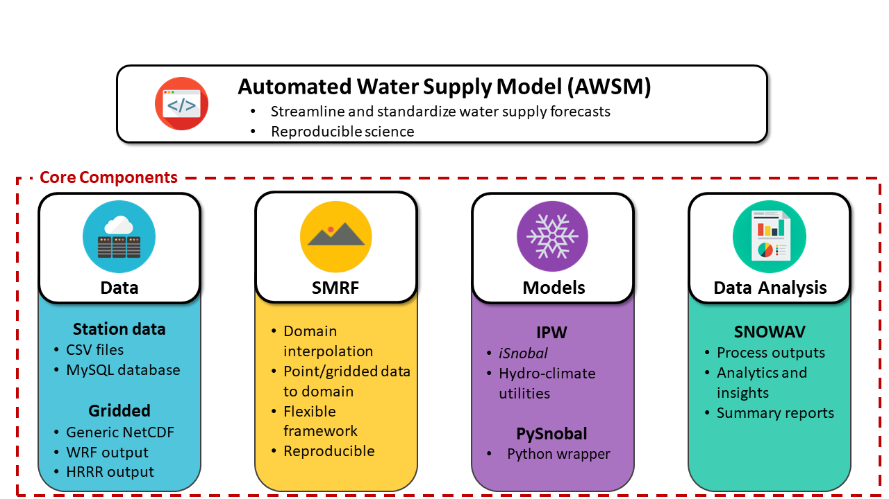

============================
Automated Water Supply Model
============================
|docs| |docker build| |docker automated|

Automated Water Supply Model (AWSM) was developed at
the USDA Agricultural Research Service (ARS) in Boise, ID. AWSM was designed to
streamline the workflow used by the ARS to forecast the water supply of multiple
water basins. AWSM standardizes the steps needed to distribute met. data with
SMRF, run an energy and mass balance with iSnobal, and process the results,
while maintaining the flexibility of each program.

Quick Start
-----------
The fastest way to get up and running with AWSM is to use the docker images that
are prebuilt and can deployed cross platform.

To build AWSM natively from source checkout the install instructions here_.

.. _here : https://awsm.readthedocs.io/en/latest/installation.html

Docker
^^^^^^
To mount a data volume, so that you can share data between the local filesystem
and the docker, the `-v` option must be used. For a more in depth dicussion and
tutorial, read about `docker volumes`_. The container has a shared data volume
at `/data` where the container can access
the local filesystem.

.. _docker volumes: https://docs.docker.com/engine/userguide/containers/dockervolumes/

When the image is run, it will go into the Python terminal within the image.
Within this terminal, AWSM can be imported. The command `/bin/bash` can be
appended to the end of docker run to enter into the docker terminal for full
control. It will start in the `/data` location with AWSM code in `/code/awsm`.

For Linux:

.. code-block:: console

  docker run -v <path>:/data -it scotthavens/awsm [/bin/bash]

For MacOSX:

.. code-block:: console

  docker run -v /Users/<path>:/data -it scotthavens/awsm [/bin/bash]

For Windows:

.. code-block:: console

  docker run -v /c/Users/<path>:/data -it scotthavens/awsm [/bin/bash]

Running the test
----------------

.. code-block:: console

  docker run -it scotthavens/awsm /bin/bash
  cd /code/smrf
  gen_maxus --out_maxus test_data/topo/maxus.nc test_data/topo/dem.ipw
  cd /code/awsm
  awsm test_data/RME_run/config_pysnobal.ini

The output netCDF files will be placed in the `/code/awsm/test_data/RME_run/output/rme/devel/wy1998/rme_test/runs/run1464_1680/output` location.

.. |docs| image:: https://readthedocs.org/projects/awsm/badge/
    :alt: Documentation Status
    :target: https://awsm.readthedocs.io

.. |docker build| image:: https://img.shields.io/docker/build/scotthavens/awsm.svg
    :alt: Docker Build Status
    :target: https://hub.docker.com/r/scotthavens/awsm/

.. |docker automated| image:: https://img.shields.io/docker/automated/scotthavens/awsm.svg
    :alt: Automated Docker Build Status
    :target: https://hub.docker.com/r/scotthavens/awsm/
